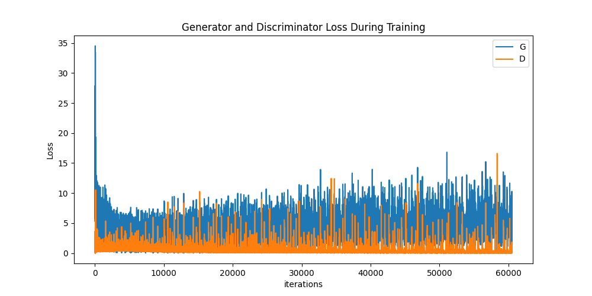
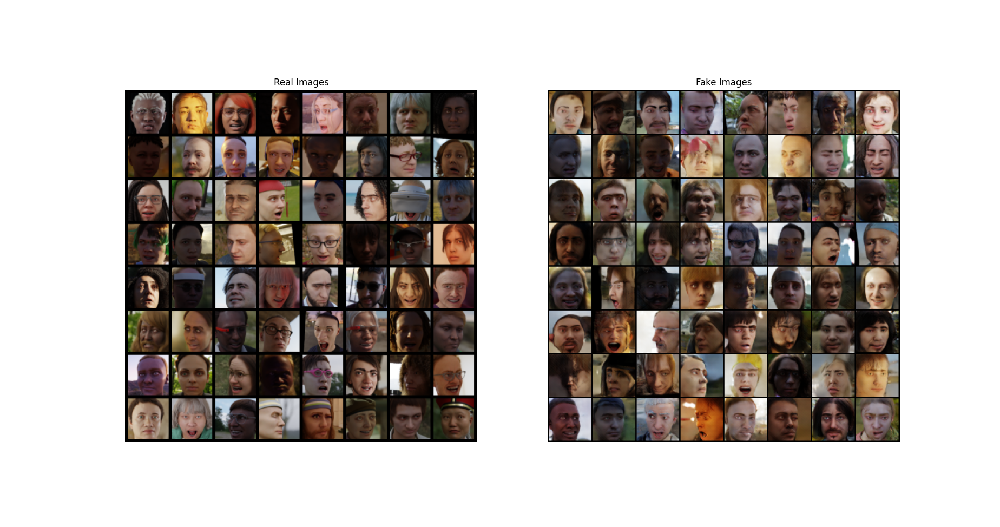
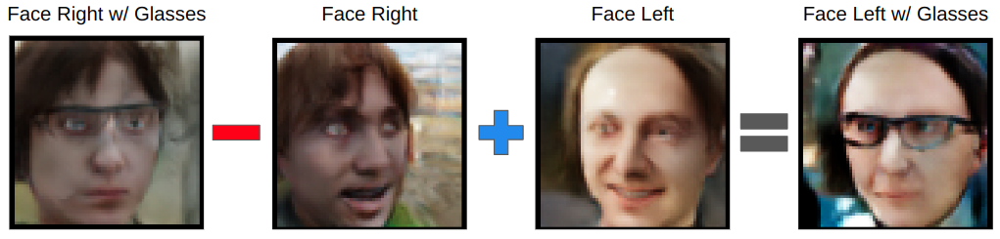

# DCGAN
Deep Convolutional Generative Adversarial Networks (DCGAN) is a class of generative adversarial networks (GAN) introduced by Radford et. al. in the paper [Unsupervised Representation Learning with Deep Convolutional Generative Adversarial Networks](https://arxiv.org/pdf/1511.06434.pdf). The generator and discriminator of DCGAN are contructed of convolutional and convolutional-transpose layers.

## Usage
Install the package (Consider installing in a virtual environment)
```bash
pip install gan_face_generate
```

Create your own GAN-generated face
```bash
gan_face_generate
```

The package works with python>=3.10, <3.13. Check [CI Result](https://github.com/chien-liu/DCGAN-PyTorch/actions/runs/7515301223)

## Dataset
[DigiFace-1M](https://github.com/microsoft/DigiFace1M) is a generated dataset for training face recognition models. The face images are high quality and thus are qualified to train a GAN network. There are two additional advantages of the dataset:

* Ethical considerations: The use of existing datasets that were collected from web images without explicit consent. In contrast, digital faces in DigiFace-1M are generated using a generative model constructed from high-quality head scans of a limited number of individuals obtained with consent.

* Data bias - DigiFace-1M is generated in a controlled pipeline, so that the racial distribution is guaranteed to be balance.

## Results
### Loss in Training Process


### Generated Images compared with Dataset Images


### Noise Arithmetic



## Reference
* [PyTorch DCGAN TUTORIAL](https://pytorch.org/tutorials/beginner/dcgan_faces_tutorial.html)
* [Unsupervised Representation Learning with Deep Convolutional Generative Adversarial Networks](https://arxiv.org/pdf/1511.06434.pdf)
* [DigiFace-1M: 1 Million Digital Face Images for Face Recognition](https://github.com/microsoft/DigiFace1M)
